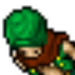
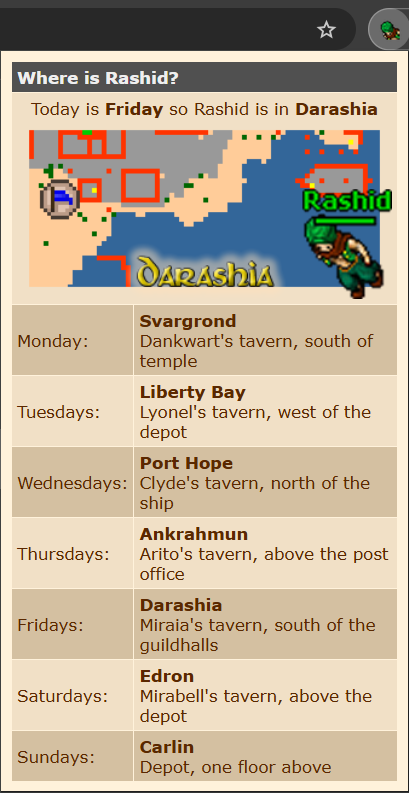

# Where is Rashid?

## Chrome Store

## Description

Chrome extension for the MMORPG Tibia. Check where is Rashid on your chrome without open any site.

## Screenshots

<picture>

 
<label>Where is rashid? Pop-up helper</label>
</picture>

## How to test it

1. Visit: `chrome://extensions` on your browser
2. Check if `Developer mode` is checked
3. Click on `Load unpacked extension...` and select the git folder

## More info

- Website: [www.moraisandre.com](https://www.moraisandre.com)
